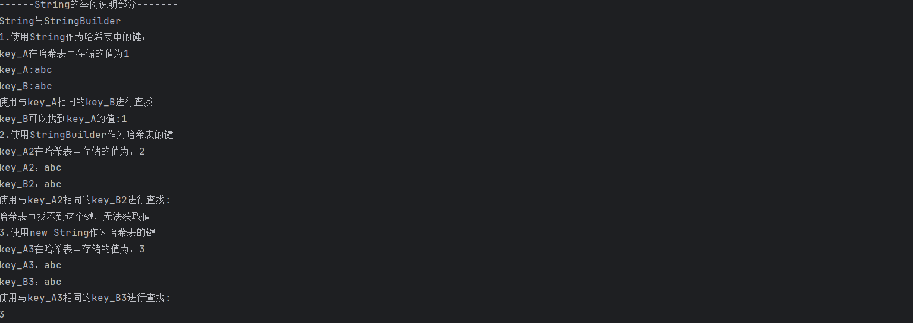
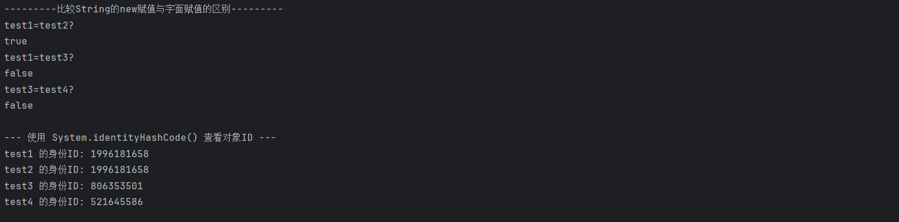

## 实验报告
### 实验目的
1. 用`hashmap`构建商品的索引，并实现查询。实现可以根据商品名称检索商品信息，可以通过商品的一个属性检索商品信息，也可以通过商品的多个属性检索商品信息。
2. 对`String`与`StringBuilder`进行区分，明确二者区别，理解`String`的不可变性。通过实例明白`String`通过`new`赋值与字面赋值内存地址的差异。
### 实验流程
1. `Commodity`类为商品类，规定商品属性。包含名称`name`,ID`cid`,商品品牌`brand`,价格`price`,屏幕大小`screenSize`,商品剩余数量`count`。
2. `SearchInfo`类用于获取用户的检索信息，满足用户多属性检索需求。
3. `SetQuery`类是执行检索的主要逻辑。
4. `Main`类进行实例验证，并完成实验目的2。
#### `Commodity`类
```java
public class Commodity {
    //定义商品的各个属性
    private String name;//商品名称
    private Double price;//商品价格
    private Double screenSize;//商品屏幕大小
    private String cid;//商品ID，唯一标识符
    private int count;//商品剩余数量
    private String brand;//商品品牌
    public Commodity(String name, String cid,String brand,Double price, Double screenSize, int count) {
        this.name = name;
        this.price = price;
        this.screenSize = screenSize;
        this.cid = cid;
        this.count = count;
        this.brand = brand;
    }
    public String getName() {
        return name;
    }
    public void setName(String name) {
        this.name = name;
    }}
```
这个代码模块主要是对商品类中的商品属性的定义，对每个商品属性进行了例如`setName()`，`getName()`一样的方法定义，用于设置对应的属性值以及获取对应的属性值
```java
@Override
    public String toString() {
        return "商品名\t"+name+"\n"+"商品ID\t"+cid+"\n"+"商品品牌\t"+brand+"\n"+"商品价格\t"+price+"\n"+"商品屏幕大小\t"+screenSize+"寸"+"\n"+"商品剩余数量\t"+count;
}
    // 重写 equals与hashcode方法，使哈希表在判断时可以根据商品ID判断是否为同一商品，从而避免检索出多余项（不过在本次实验中似乎没用）
    @Override
    public boolean equals(Object o) {
        if (this == o) return true;
        if (o == null || getClass() != o.getClass()) return false;
        Commodity commodity = (Commodity) o;
        return Objects.equals(cid, commodity.cid);
    }

    @Override
    public int hashCode() {
        return Objects.hash(cid);
    }

```
这个代码块是三个重写方法。重写`toString()`方法，使得在打印商品时可以更好的描述商品信息；重写`equals`和`hashCode`方法，使哈希表在判断时可以根据商品ID判断是否为同一商品，从而避免检索出多余项（不过在本次实验中似乎没用）
#### `SearchInfo`类
```java
/** SearchInfo类用于获取用户的检索需求，可以使用户灵活据欸的那个检索商品时所依据的属性数量*/
public class SearchInfo {
    private String cid;
    private String name;
    private Double price;
    private Double screenSize;
    private String brand;
    public  String getCid() {
        return cid;
    }
    public void setCid(String cid) {this.cid = cid;}
    public String getName() {return name;}
    public void setName(String name) {this.name = name;}
    public Double getPrice() {return price;}
    public void setPrice(double price) {this.price = price;}
    public Double getScreenSize() {return screenSize;}
    public void setScreenSize(Double screenSize) {this.screenSize = screenSize;}
    public String getBrand() {return brand;}
    public void setBrand(String brand) {this.brand = brand;}

}
```
SearchInfo类用于获取用户的检索需求，可以使用户灵活决定检索商品时所依据的属性数量。通过对每个属性设置`get`和`set`方法，实现获取用户的检索条件，将用户的检索条件传递给检索函数
#### `SetQuery`类
```java
public class SetQuery {
    HashMap<String, List<Commodity>> nameIndex = new HashMap<>();
    HashMap<Double, List<Commodity>> priceIndex = new HashMap<>();
    HashMap<Double, List<Commodity>> screenIndex = new HashMap<>();
    HashMap<String, List<Commodity>> idIndex = new HashMap<>();
    HashMap<String, List<Commodity>> brandIndex = new HashMap<>();

    /**
     * addCommodity 通过构建多个商品属性的哈希表来构建商品属性索引，类似于倒排文档
     * @param c 为传入的商品实例
     */
    public void addCommodity(Commodity c) {
        List<Commodity> nameList = nameIndex.getOrDefault(c.getName(), new ArrayList<>());
        nameList.add(c);
        nameIndex.put(c.getName(), nameList);

        List<Commodity> priceList = priceIndex.getOrDefault(c.getPrice(), new ArrayList<>());
        priceList.add(c);
        priceIndex.put(c.getPrice(), priceList);

        List<Commodity> screenList = screenIndex.getOrDefault(c.getScreenSize(), new ArrayList<>());
        screenList.add(c);
        screenIndex.put(c.getScreenSize(), screenList);

        List<Commodity> idList = idIndex.getOrDefault(c.getCid(), new ArrayList<>());
        idList.add(c);
        idIndex.put(c.getCid(), idList);

        List<Commodity> brandList = brandIndex.getOrDefault(c.getBrand(), new ArrayList<>());
        brandList.add(c);
        brandIndex.put(c.getBrand(), brandList);
    }
}
```
这里的`addCommodity()`方法，是在我们建立起商品实例之后，依据商品属性对我们创建的商品实例构建索引的方法。这里采用哈希表进行存储，因为获取哈希表的值效率高，并且哈希表的键与其对应的值是一个一一对应的关系。
使用了`HashMap`类中的`getOrSefault()`方法完成对应商品列表的初始化与获取操作。并使用其put()方法实现覆盖。
```java
public List<Commodity> intersection(List<Commodity> lc1, List<Commodity> lc2) {
        Set<Commodity> set = new HashSet<>(lc1);
        List<Commodity> result = new ArrayList<>();
        for (Commodity c : lc2) {
            if (set.contains(c)) {
                result.add(c);
            }
        }
        return result;
    }
   ```
`intersection()`方法是自定义的对检索得到的两个商品列表求交集的算法。通过将其中一个商品列表转化为哈希集合，遍历另一个商品列表来得到两个商品列表的交集。相比`ArrayList()`自带的`retainAll`方法，该方法不会修改原列表(虽然在本代码中没有体现)，并且`retainAll`在计算两个列表交集时的运算效率为O(M*N)，而本方法的效率仅为O(M+N)。因此本方法普适性更强，效率更高。
```java
private List<Commodity> getAllCommodities() {
        Set<Commodity> allCommoditiesSet = new HashSet<>();
        // 遍历任何一个索引的所有值即可
        for (List<Commodity> list : nameIndex.values()) {
            allCommoditiesSet.addAll(list);
        }
        return new ArrayList<>(allCommoditiesSet);
    }
```
`getAllCommodities()`方法通过遍历索引并使用`HashSet`去重，来获取一个包含所有不重复商品的列表。在`search()`方法中，这个列表将作为初始的候选集，后续的所有筛选都将在这个集合的基础上进行。
```java
public List<Commodity> search(SearchInfo s) {
        // 1. 从一个包含所有商品的列表开始作为我们的初始候选集
        List<Commodity> candidates = getAllCommodities();

        // 2. 如果提供了名称，就用名称的查询结果来筛选（求交集）
        if (s.getName() != null) {
            // 使用 getOrDefault 并提供一个空列表作为默认值，彻底避免 null
            List<Commodity> nameResults = nameIndex.getOrDefault(s.getName(), new ArrayList<>());
            candidates = intersection(candidates,nameResults);
        }

        // 3. 如果提供了价格，继续在上面的结果上筛选
        if (s.getPrice() != null) {
            List<Commodity> priceResults = priceIndex.getOrDefault(s.getPrice(), new ArrayList<>());
            candidates = intersection(candidates,priceResults);
        }

        // 4. 如果提供了CID，继续筛选
        if (s.getCid() != null) {
            List<Commodity> cidResults = idIndex.getOrDefault(s.getCid(), new ArrayList<>());
            candidates = intersection(candidates,cidResults);
        }

        // 5. 如果提供了屏幕尺寸，继续筛选
        if (s.getScreenSize() != null) {
            List<Commodity> screenResults = screenIndex.getOrDefault(s.getScreenSize(), new ArrayList<>());
            candidates = intersection(candidates,screenResults);
        }
        if (s.getBrand() != null) {
            List<Commodity> brandResults = brandIndex.getOrDefault(s.getBrand(), new ArrayList<>());
            candidates = intersection(candidates,brandResults);
        }

        // 6. 返回经过所有有效条件筛选后的最终结果
        return candidates;
    }
```
`search()`方法是处理多商品属性检索时的主要方法。从一个包含所有商品的列表开始作为我们的初始候选集，逐一判断用户的检索信息中是否包含相应的商品属性，如果包含了就求交集
#### `Main`类
创建商品实例
```java
Commodity[] shop = {
                new Commodity("HW01", "01","HW",3000.0, 14.0, 10),
                new Commodity("LX01", "02", "LX",3500.0,14.0, 6),
                new Commodity("HS01", "03", "HS",4000.0,14.0, 8),
                new Commodity("MC01", "04", "MC",4000.0,12.0, 9),
                new Commodity("HP01", "05", "HP",4000.0,12.0,  10),
                new Commodity("HP02", "06", "HP",3000.0,12.0,  8)
                    };
        String message = "成功创建了"+shop.length+"个商品";
```
构建商品索引
```java
SetQuery setQuery = new SetQuery();
        for(Commodity c : shop){
            setQuery.addCommodity(c);
            System.out.println("已添加: " + c.getName());
        }
        System.out.println("商品索引添加完毕");
```
进行三个查询任务
```java
System.out.println("根据商品名称进行查询:");
        SearchInfo searchInfo = new SearchInfo();
        searchInfo.setName("HW01");//查询商品名称为“HW01”的商品信息
        List<Commodity> query = setQuery.search(searchInfo);
        System.out.println("-> 共找到"+query.size()+"件商品");
        for(Commodity c : query){
            System.out.println("------------------");
            System.out.println(c);
        }

        System.out.println("根据一个商品属性进行查询");
        SearchInfo searchInfo_1  = new SearchInfo();
        searchInfo_1.setScreenSize(14.0);
       List<Commodity> queryResult1 = setQuery.search(searchInfo_1);
       System.out.println("->  共找到"+queryResult1.size()+"件商品");
       for (Commodity c : queryResult1){
           System.out.println("-------------------");
           System.out.println(c);
       }

       System.out.println("根据多个商品属性进行查询");
       SearchInfo searchInfo_2  = new SearchInfo();
       searchInfo_2.setScreenSize(12.0);
       searchInfo_2.setPrice(4000.0);
       searchInfo_2.setBrand("MC");
       List<Commodity> queryResult2 = setQuery.search(searchInfo_2);
       System.out.println("->  共找到"+queryResult2.size()+"件商品");
       for (Commodity c : queryResult2){
           System.out.println("-------------------");
           System.out.println(c);
       }
```
查询结果：


```java
System.out.println("------String的举例说明部分-------");
       System.out.println("String与StringBuilder");
       System.out.println("1.使用String作为哈希表中的键：");
       String key_A = "abc";
       Map<String, Integer> testmap = new HashMap<>();
       testmap.put(key_A,1);
       System.out.println("key_A在哈希表中存储的值为"+testmap.get(key_A));
       String key_B = "abc";
       System.out.println("key_A:"+key_A);
       System.out.println("key_B:"+key_B);
       System.out.println("使用与key_A相同的key_B进行查找");
       if(testmap.containsKey(key_B)){
           System.out.println("key_B可以找到key_A的值:"+testmap.get(key_B));
       }
       else{System.out.println("哈希表中找不到这个值");}

       System.out.println("2.使用StringBuilder作为哈希表的键");
       StringBuilder key_A2 = new StringBuilder("abc");
       Map<StringBuilder, Integer> testmap2 = new HashMap<>();
       testmap2.put(key_A2,2);
       System.out.println("key_A2在哈希表中存储的值为："+testmap2.get(key_A2));
       StringBuilder key_B2 = new StringBuilder("abc");
       System.out.println("key_A2："+key_A2);
       System.out.println("key_B2："+key_B2);
       System.out.println("使用与key_A2相同的key_B2进行查找:");
       if(testmap2.containsKey(key_B2)){
           System.out.println(testmap2.get(key_B2));
       }
       else {
           System.out.println("哈希表中找不到这个键，无法获取值");
       }

       System.out.println("3.使用new String作为哈希表的键");
       String key_A3 = new String("abc");
       Map<String, Integer> testmap3 = new HashMap<>();
       testmap3.put(key_A3,3);
       System.out.println("key_A3在哈希表中存储的值为："+testmap3.get(key_A3));
       String key_B3 = new String("abc");
       System.out.println("key_A3："+key_A3);
       System.out.println("key_B3："+key_B3);
       System.out.println("使用与key_A3相同的key_B3进行查找:");
       if(testmap3.containsKey(key_B3)){
           System.out.println(testmap3.get(key_B3));
       }
       else {
           System.out.println("哈希表中找不到这个键，无法获取值");
       }
```
这个代码块是关于`String`与`StringBuilder`的对比。使用`String`作为哈希表键的时候，由于`String`重写了`hashCode()`与`equals()`方法，因此只要它们的字符数组一样，那么它们就会通过`hashmap`的检查，返回对应的值，所以即使使用`new`来创建`String`实例进行赋值也可以满足条件。而`StringBuilder`类没有重写这两个方法，它的`hashcode`仍然与其身份码息息相关，因此创建两个实例`StringBuilder()`，由于它们的身份码不同，即使它们的字符数组完全一样，它们的`hashcode`也不同，因此不能通过`hashmap`的检查。因此当我们用`StringBuilder()`作为哈希表的键时，我们只能通过调用存储时的哪个实例来获取对应的值。如示例代码中的`key_A2`,我们想获取它存储的值只能通过调用它来实现，不能通过新建一个实例来实现，这样的后果是使哈希表失去了重要的查找功能。正如这次的商品检索，我们在设置商品索引时会存储实例A，而用户查询时会输入实例B，即使实例B与实例A的字符数组一样，仍然不能检索到对应的商品。  
运行结果：

```java
       System.out.println("---------比较String的new赋值与字面赋值的区别---------");
       String test1 = "abc";
       String test2 = "abc";
       String test3 = new String("abc");
       String test4 = new String("abc");
       System.out.println("test1=test2?\n"+ (test1==test2));
       System.out.println("test1=test3?\n"+ (test1==test3));
       System.out.println("test3=test4?\n"+ (test3==test4));
       System.out.println("\n--- 使用 System.identityHashCode() 查看对象ID ---");
       System.out.println("test1 的身份ID: " + System.identityHashCode(test1));
       System.out.println("test2 的身份ID: " + System.identityHashCode(test2));
       System.out.println("test3 的身份ID: " + System.identityHashCode(test3));
       System.out.println("test4 的身份ID: " + System.identityHashCode(test4));
```
这个代码块是比较`String`的`new`赋值与字面赋值存储位置的区别。通过"=="方法，可以验证它们的存储地址是否相同，这里不用`equals()`的原因，正如前文所说，`equals()`被重写了，因此使用它来检查，结果必然都是`true`。
使用`System.identityHashCode()`方法查看其身份码，这个身份码是JVM为每个对象实例提供的唯一标识，通常根据对象的初始内存地址计算得出，并且在对象的生命周期保持不变，如果两个对象的身份码不同，它们就绝对是两个不同的对象实例。  

运行结果：

### 实验总结
本次实验成功地使用`HashMap`构建了一套多属性、可组合查询的商品索引系统。通过将商品的不同属性（如名称、品牌、价格）作为键，将商品列表作为值，我们实现了类似倒排索引的高效单属性查询。对于多属性的组合查询，本系统通过逐层求交集的方式，对初始候选集进行筛选，最终得到满足所有条件的商品列表，展现了良好的灵活性和扩展性。  
实验第二部分探究了`HashMap`键的核心要求。通过对比`String`和`StringBuilder`作为键的不同表现，验证了不可变性对于键的重要性。`String`因其不可变性，以及基于内容重写的`hashCode()`和`equals()`方法，确保了`HashMap`的稳定性和可靠性。而`StringBuilder`作为可变对象，且其`hashCode()`和`equals()`基于身份，在作为键时会导致数据“逻辑丢失”和一系列不可预测的行为，证明了其不适合作为键。  
最后，通过`==`运算符和`System.identityHashCode()`的对比，本实验清晰地展示了`String`字面量赋值（共享常量池对象）和`new`关键字赋值（创建独立堆对象）在内存管理上的根本差异。
综上，本实验不仅依据`HashMap`构建了商品索引，在完成编程任务的同时，也加深了对`HashMap`底层原理，`String`不可变性及Java相等性判断等核心概念的理解。
